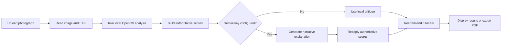

<p align="center">
  
</p>

<h1 align="center">FocalPointAI</h1>

<p align="center">
  <strong>An AI-assisted photography coach that turns every photograph into a personalized learning experience.</strong>
</p>

<p align="center">
  Upload a photo &rarr; measure visual evidence &rarr; understand the critique &rarr; practice the right skills
</p>

<p align="center">
  
  
  
  
  <a href="https://focalpointai.vercel.app"></a>
  <a href="LICENSE"></a>
</p>

<p align="center">
  <a href="#live-demo">Live demo</a> &middot;
  <a href="#quick-start">Quick start</a> &middot;
  <a href="#how-it-works">How it works</a> &middot;
  <a href="#api-reference">API</a> &middot;
  <a href="#roadmap">Roadmap</a>
</p>

<p align="center">
  <a href="https://focalpointai.vercel.app">
    
  </a>
</p>

FocalPointAI analyzes a photograph with deterministic computer-vision measurements, explains the findings in practical photography language, recommends focused learning material, and produces a downloadable critique report. Gemini can improve the narrative, but the application-owned evidence and scores remain authoritative.

> [!NOTE]
> This repository is a functional MVP. The public deployment may take a moment to respond when the Render backend is waking from an idle state.

## Live Demo

| Service | URL |
| --- | --- |
| Web application | [focalpointai.vercel.app](https://focalpointai.vercel.app) |
| Backend API | [focalpointai.onrender.com](https://focalpointai.onrender.com) |
| Interactive API documentation | [focalpointai.onrender.com/docs](https://focalpointai.onrender.com/docs) |

## Why FocalPointAI?

Photography feedback is often subjective: a comment may say that an image feels weak without explaining why or how to improve it.

FocalPointAI combines measurable image evidence, established photography principles, and optional AI-written explanations to answer three useful questions:

- Why does this image work, or fail to work?
- What is the most valuable improvement to make next?
- Which technique should the photographer practice?

Unlike a generic AI image critic, FocalPointAI continues to provide structured feedback without a cloud model and prevents provider-generated text from replacing its locally computed scores.

## Features

### Image intelligence

- Exposure, contrast, saturation, sharpness, clutter, and color-palette analysis
- Subject placement, saliency, horizon, face, eye, sky, and composition signals
- EXIF extraction for camera, lens, shutter speed, aperture, ISO, and focal length
- Intent-aware evaluation for styles such as minimalism, monochrome, and atmospheric photography

### Actionable learning

- Overall and category-level scores backed by local evidence
- Plain-language strengths, quick wins, and improvement guidance
- Personalized tutorials ranked from a curated local catalog
- Optional Gemini narrative critique with automatic local fallback

### Shareable results

- Responsive React critique workspace with visual evidence and category details
- Multi-page PDF report containing the photograph, scores, recommendations, metadata, and tutorial links
- JPEG, PNG, and WebP uploads up to 15 MB in the current web interface

## Example Critique

An analysis connects an observation to a concrete action instead of returning only a score. A representative result looks like this:

> **Observation:** The subject has strong separation, but the bright background competes for attention.
>
> **Next step:** Reduce the background highlights and use a tighter crop to strengthen the visual hierarchy.
>
> **Practice:** Review subject isolation and background-control techniques.

The exact categories, evidence, and recommendations depend on the uploaded photograph and its available metadata.

## How It Works



| Layer | Responsibility |
| --- | --- |
| React + Vite | Upload workflow, progress states, evidence dashboard, tutorials, and PDF download |
| FastAPI | Image validation, route orchestration, metadata, analysis, and report responses |
| OpenCV + NumPy + Pillow | Local measurements, image preparation, saliency, composition signals, and EXIF handling |
| Score and intent engines | Deterministic scoring, interpretation guardrails, and intent-aware feedback |
| Gemini adapter | Optional narrative explanation; it does not own numeric scores |
| ReportLab | Branded multi-page PDF critique generation |

## Quick Start

### Backend

```powershell
py -m venv .venv
.\.venv\Scripts\Activate.ps1
python -m pip install -r backend\requirements.txt
cd backend
uvicorn main:app --reload --host 127.0.0.1 --port 8000
```

### Frontend

In a second terminal:

```powershell
cd frontend
npm ci
npm run dev
```

Open the URL printed by Vite, normally `http://localhost:5173`. The API health response is at `http://127.0.0.1:8000/`, and interactive API documentation is at `http://127.0.0.1:8000/docs`.

## Installation and Configuration

### Prerequisites

- Python 3.10 or newer
- Node.js `^20.19.0` or `>=22.12.0`
- npm
- A Gemini API key only when AI-written narrative feedback is wanted

Clone the project and enter the repository:

```powershell
git clone <repository-url>
cd FocalPointAI
```

On macOS or Linux, create the environment with `python3 -m venv .venv`, activate it with `source .venv/bin/activate`, and use forward slashes in commands.

### Optional Gemini analysis

Create `backend/.env` only when Gemini feedback is wanted:

```dotenv
GEMINI_API_KEY=your_api_key_here
```

Do not commit this file. It is excluded by `.gitignore`. When the key is absent or the provider request fails, the application uses its local computer-vision critique.

### Environment variables

| Variable | Location | Required | Purpose |
| --- | --- | --- | --- |
| `GEMINI_API_KEY` | `backend/.env` or process environment | No | Enables Gemini narrative analysis; local CV remains the fallback and score authority. |
| `VITE_BACKEND_URL` | `frontend/.env.local` or build environment | No for local use | Overrides `http://127.0.0.1:8000`; set it for deployment. |
| `VITE_SHOW_LEGACY_SCANNER` | `frontend/.env.local` | No | Enables the legacy scanner visualization. |

Example frontend configuration:

```dotenv
VITE_BACKEND_URL=https://focalpointai.onrender.com
```

Vite reads environment variables at startup, so restart the frontend after changing them.

## API Reference

| Method | Endpoint | Description |
| --- | --- | --- |
| `GET` | `/` | Returns backend health and application status |
| `POST` | `/image-metadata` | Returns lightweight camera metadata for an uploaded image |
| `POST` | `/analyze` | Runs the complete critique pipeline for an uploaded image |
| `POST` | `/critique-pdf` | Builds a PDF from an existing analysis payload and optional image |
| `GET` | `/tutorials` | Returns the curated tutorial catalog |
| `POST` | `/tutorial-recommendations` | Ranks tutorials for an existing analysis payload |

Use the [public Swagger UI](https://focalpointai.onrender.com/docs), or `http://127.0.0.1:8000/docs` while the backend is running locally, for request schemas and interactive testing.

## Development and Verification

Run backend tests from the repository root:

```powershell
.\.venv\Scripts\python.exe -m unittest discover -s backend -p "test_*.py" -v
```

Run frontend quality checks:

```powershell
cd frontend
npm run lint
npm run build
```

The locally verified baseline on July 18, 2026 was 19 passing backend tests, a clean frontend lint run, and a successful production build. This is a dated baseline, not a continuously updated CI badge.

## Project Structure

```text
FocalPointAI/
|-- backend/
|   |-- main.py                         # FastAPI routes and orchestration
|   |-- local_cv_engine.py              # OpenCV and NumPy measurements
|   |-- score_engine.py                 # Deterministic scores and AI guardrails
|   |-- intent_engine.py                # Intent-aware technique evaluation
|   |-- gemini_analysis.py              # Optional Gemini request handling
|   |-- pdf_engine.py                   # PDF critique generation
|   |-- tutorial_recommendation_engine.py
|   |-- tutorials_catalog.json
|   `-- test_*.py
|-- frontend/
|   |-- public/                         # Fonts, brand assets, and quote data
|   `-- src/                            # React interface and styles
|-- docs/
|   `-- PROJECT_REPORT.md               # Technical and product assessment
|-- fonts/                              # Google Sans files used by reports
|-- roadmap.md                          # Long-term product roadmap
`-- README.md
```

## Roadmap

### Shipped in the MVP

- Local image analysis and deterministic scoring
- Optional Gemini explanations with score guardrails
- EXIF extraction and intent-aware feedback
- Tutorial recommendations and PDF reports

### Release hardening

- Enforce upload and decoded-image limits consistently on every API route
- Restrict production CORS and validate deployment configuration
- Pin backend dependencies and add continuous integration
- Validate Gemini behavior with a live key and representative image set
- Add licensed local demo images, screenshots, and browser-level tests

### Planned product work

- RAW decoding and richer camera-setting intelligence
- Concrete crop overlays and structured Lightroom adjustment guidance
- Accounts, saved analyses, progress tracking, and personalized coaching
- Learning challenges, portfolio review, and community critique features

See the [full roadmap](roadmap.md) and [project report](docs/PROJECT_REPORT.md) for detailed status and priorities.

## Contributing

Feedback and focused improvements are welcome while the project is in MVP development:

1. Fork the repository and create a descriptive feature branch.
2. Keep changes scoped and add or update tests where behavior changes.
3. Run the backend tests, frontend lint, and production build.
4. Open a pull request explaining the problem, approach, and verification performed.

Before actively accepting external contributions, the project should add a `CONTRIBUTING.md`, a code of conduct, and CI checks.

## Current Limitations

- There is no authentication, database, analysis history, or cloud image storage.
- RAW camera formats are not supported; the current UI accepts JPEG, PNG, and WebP.
- The `/analyze` route does not yet enforce the same 15 MB server-side limit used by the UI and selected auxiliary routes.
- Production CORS is not restricted, backend dependencies are not pinned, and CI is not configured.
- Gemini model access, quota, and response behavior must be verified with a live key before deployment.
- The included demo photographs load from Unsplash and require internet access.

## Privacy

Without `GEMINI_API_KEY`, image critique runs locally inside the backend process. When Gemini is enabled, the uploaded image and computed analysis context are sent to Google's Gemini API.

The public deployment should provide clear in-product consent and define image retention, deletion, provider disclosure, and logging policies. The active API does not intentionally persist uploaded images or analysis results.

## License

FocalPointAI is available under the [MIT License](LICENSE). You may use, copy, modify, merge, publish, distribute, sublicense, and sell copies subject to the license terms.
