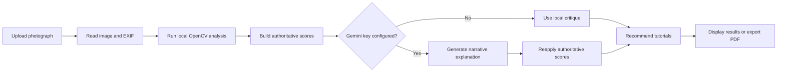

# FocalPointAI

FocalPointAI is a web-based photography mentor that analyzes a photograph and returns an evidence-based critique. It combines deterministic OpenCV measurements with optional Gemini-generated explanations, then presents scores, improvement advice, camera metadata, learning recommendations, and a downloadable PDF report.

The project is currently a functional MVP intended for local development and evaluation.

## Features

- Drag-and-drop upload for JPEG, PNG, and WebP images up to 15 MB in the web interface
- Local analysis of exposure, contrast, color, sharpness, subject placement, faces, horizon, clutter, saliency, and composition signals
- EXIF extraction for camera, lens, shutter speed, aperture, ISO, and focal length when metadata is available
- Deterministic application-owned scores that remain authoritative when Gemini is enabled
- Optional Gemini narrative critique with automatic local-computer-vision fallback
- Intent-aware feedback for styles such as minimalism, monochrome, and atmospheric photography
- Personalized tutorials selected from a curated local catalog
- Multi-page PDF critique export with the analyzed photograph and tutorial links
- Responsive React results workspace with strengths, quick wins, visual evidence, and category-level details

## How It Works



Local computer vision and EXIF data own the evidence and numeric scores. Gemini, when configured, adds language and interpretation but cannot replace those scores.

## Technology Stack

- Frontend: React 19, Vite 8, Lucide React, CSS
- Backend: Python 3.10+, FastAPI, Uvicorn
- Image analysis: OpenCV, NumPy, Pillow
- Optional AI: Google Gemini REST API through HTTPX
- Reports: ReportLab
- Tests: Python `unittest` and Oxlint

## Prerequisites

- Python 3.10 or newer
- Node.js `^20.19.0` or `>=22.12.0`
- npm
- A Gemini API key only if AI-written narrative feedback is required

The application remains usable without a Gemini key by falling back to local analysis.

## Local Setup

### 1. Clone and enter the repository

```powershell
git clone <repository-url>
cd FocalPointAI
```

### 2. Create the backend environment

From the repository root:

```powershell
py -m venv .venv
.\.venv\Scripts\Activate.ps1
python -m pip install --upgrade pip
python -m pip install -r backend\requirements.txt
```

On macOS or Linux, activate the environment with `source .venv/bin/activate` and use forward slashes in paths.

### 3. Configure optional Gemini analysis

Create `backend/.env` only if Gemini feedback is wanted:

```dotenv
GEMINI_API_KEY=your_api_key_here
```

Do not commit this file. It is already excluded by `.gitignore`.

### 4. Start the API

```powershell
cd backend
uvicorn main:app --reload --host 127.0.0.1 --port 8000
```

The health response is available at `http://127.0.0.1:8000/`, and interactive API documentation is available at `http://127.0.0.1:8000/docs`.

### 5. Start the frontend

Open another terminal:

```powershell
cd frontend
npm ci
npm run dev
```

Open the local URL printed by Vite, normally `http://localhost:5173`.

## Configuration

| Variable | Location | Required | Purpose |
| --- | --- | --- | --- |
| `GEMINI_API_KEY` | `backend/.env` or process environment | No | Enables Gemini narrative analysis. Local CV is used when absent or when Gemini fails. |
| `VITE_BACKEND_URL` | `frontend/.env.local` or build environment | No for local use | Overrides the default API URL, `http://127.0.0.1:8000`. Set this for deployment. |
| `VITE_SHOW_LEGACY_SCANNER` | `frontend/.env.local` | No | Enables the legacy scanner visualization. |

Example frontend configuration:

```dotenv
VITE_BACKEND_URL=https://api.example.com
```

Vite reads environment variables at startup, so restart the frontend after changing them.

## API Endpoints

| Method | Endpoint | Description |
| --- | --- | --- |
| `GET` | `/` | Backend health and application status |
| `POST` | `/image-metadata` | Returns lightweight camera metadata for an uploaded image |
| `POST` | `/analyze` | Runs the complete critique pipeline for an uploaded image |
| `POST` | `/critique-pdf` | Builds a PDF from an existing analysis payload and optional image |
| `GET` | `/tutorials` | Returns the curated tutorial catalog |
| `POST` | `/tutorial-recommendations` | Ranks tutorials for an existing analysis payload |

## Verification

Run the backend tests from the repository root:

```powershell
.\.venv\Scripts\python.exe -m unittest discover -s backend -p "test_*.py" -v
```

Run frontend quality checks:

```powershell
cd frontend
npm run lint
npm run build
```

The verified baseline on July 18, 2026 is 19 passing backend tests, a clean frontend lint run, and a successful production build.

## Project Structure

```text
FocalPointAI/
|-- backend/
|   |-- main.py                         # FastAPI routes and analysis orchestration
|   |-- local_cv_engine.py              # OpenCV/NumPy image measurements
|   |-- score_engine.py                 # Deterministic scores and Gemini guardrails
|   |-- intent_engine.py                # Intent-aware technique evaluation
|   |-- gemini_analysis.py              # Optional Gemini request handling
|   |-- pdf_engine.py                   # PDF critique generation
|   |-- tutorial_recommendation_engine.py
|   |-- tutorials_catalog.json
|   `-- test_*.py
|-- frontend/
|   |-- public/                         # Fonts, brand assets, and quote data
|   `-- src/                            # React interface and styles
|-- docs/
|   `-- PROJECT_REPORT.md               # Current technical and product report
|-- fonts/                              # Google Sans files used by reports
|-- roadmap.md                          # Long-term product roadmap
`-- README.md
```

## Current Limitations

- There is no authentication, database, analysis history, or cloud image storage.
- RAW camera formats are not supported; the current UI accepts JPEG, PNG, and WebP.
- The `/analyze` route should enforce its own upload limit; the 15 MB check currently exists in the UI and selected auxiliary API routes.
- Production CORS is not restricted yet.
- Backend dependencies are not version-pinned, and continuous integration is not configured.
- Gemini behavior, quota, and the configured model must be verified with a live key before deployment.
- The included demo photographs are loaded from Unsplash and require internet access.

See [the project report](docs/PROJECT_REPORT.md) for the full status assessment and [the roadmap](roadmap.md) for planned development.

## Privacy Note

Without `GEMINI_API_KEY`, image critique runs locally in the backend process. When Gemini is enabled, the uploaded image and computed analysis context are sent to Google's Gemini API. A production deployment should disclose this behavior and define image retention, consent, deletion, and logging policies.

## License

No license file is currently included. Add a license before distributing or accepting external contributions.
