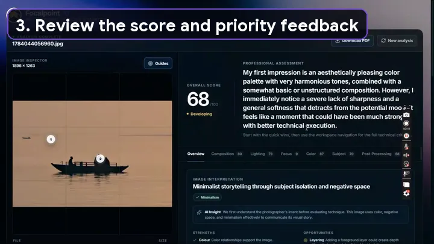
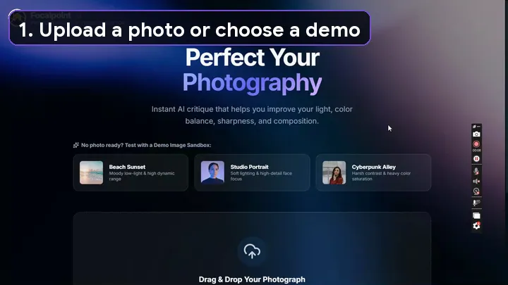
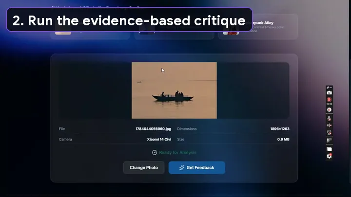
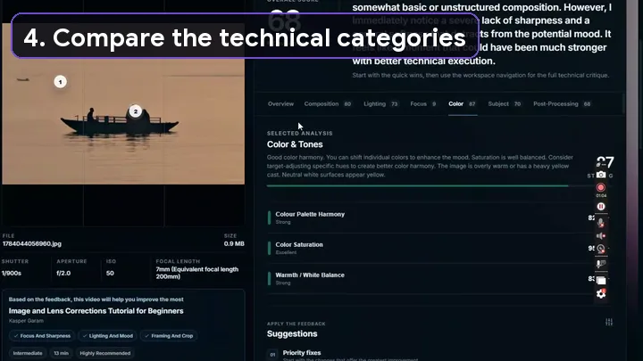
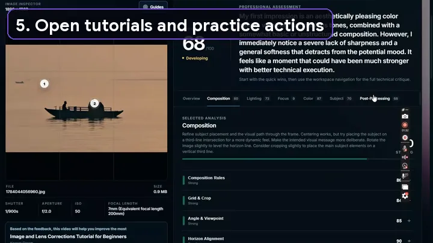
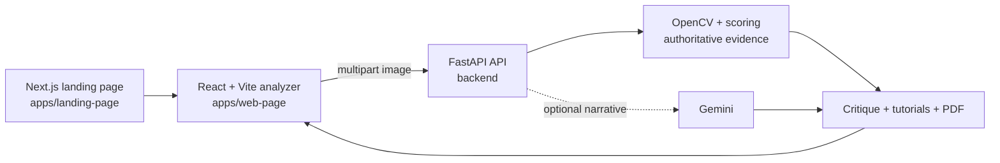

<p align="center">
  
</p>

<h1 align="center">Snapgrade</h1>

<p align="center">
  <strong>Photography feedback you can see, understand, and act on.</strong>
</p>

<p align="center">
  Snapgrade reads a photograph with local computer vision, turns the evidence into a structured critique, and recommends what to practice next.
</p>

<p align="center">
  <a href="https://snapgradebyark.vercel.app">Landing page</a> ·
  <a href="https://snapgrade-app.vercel.app">Open the analyzer</a> ·
  <a href="https://snapgrade-api.onrender.com/docs">API docs</a>
</p>

<p align="center">
  
  
  
  
  
</p>

<p align="center">
  
</p>

## What Snapgrade does

Most photo critiques stop at taste: *the composition feels weak* or *the light could be better*. Snapgrade connects that feedback to measurable evidence and a useful next step.

- Reads JPEG, PNG, and WebP photographs, including available EXIF metadata.
- Measures exposure, contrast, colour, sharpness, saliency, subject placement, geometry, and other visual signals with OpenCV.
- Produces deterministic overall and category scores owned by the application—not by a language model.
- Explains strengths, competing elements, quick wins, and practice directions in plain photography language.
- Ranks lessons from a curated local tutorial catalog.
- Exports the critique, metadata, recommendations, and photograph as a multi-page PDF.
- Optionally uses Gemini to improve the narrative while preserving locally computed scores and falling back cleanly when Gemini is unavailable.

The current MVP is stateless: it has no accounts, database, saved analysis history, or cloud image library.

## Product flow

<table>
  <tr>
    <td width="20%" valign="top"><strong>1. Choose</strong><br>Drop a photograph or select it from the file picker.</td>
    <td width="20%" valign="top"><strong>2. Measure</strong><br>Validate the image, read EXIF, and extract visual evidence.</td>
    <td width="20%" valign="top"><strong>3. Interpret</strong><br>Build guarded scores and an intent-aware critique.</td>
    <td width="20%" valign="top"><strong>4. Learn</strong><br>Review evidence, fixes, and matched tutorials.</td>
    <td width="20%" valign="top"><strong>5. Export</strong><br>Download the result as a portable PDF.</td>
  </tr>
</table>

The walkthrough below uses animated WebP captures rather than GIFs: they play inline on GitHub while keeping the repository considerably smaller.

<details>
  <summary>See the walkthrough</summary>
  <br>
  <p align="center">
    <br><br>
    <br><br>
    <br><br>
    
  </p>
</details>

## Architecture

Snapgrade is three independently runnable applications in one repository.


```mermaid
flowchart LR
    L["Next.js landing page<br/>apps/landing-page"] --> W["React + Vite analyzer<br/>apps/web-page"]
    W -->|"multipart image"| A["FastAPI API<br/>backend"]
    A --> C["OpenCV + scoring<br/>authoritative evidence"]
    A -. "optional narrative" .-> G["Gemini"]
    C --> R["Critique + tutorials + PDF"]
    G --> R
    R --> W
```

| Part | Stack | Responsibility |
| --- | --- | --- |
| Landing page | Next.js 16, React 19, TypeScript, Tailwind CSS, Motion | Product story and entry into the analyzer |
| Analyzer | React 19, Vite 8, Tailwind CSS, Recharts, Base UI | Upload, analysis state, evidence explorer, recommendations, and PDF download |
| API | FastAPI, Pillow, OpenCV, NumPy, ReportLab | Validation, EXIF, local vision, scoring, optional Gemini narrative, tutorials, and PDF generation |

The browser normalizes the canonical API response in `apps/web-page/src/lib/result-read.js`. On the server, the score and intent engines remain authoritative even when Gemini is configured.

## Quick start

### Prerequisites

- Python 3.10+
- Node.js `^20.19.0` or `>=22.12.0`
- npm

Clone the repository:

```powershell
git clone https://github.com/ofcourseabhishek/FocalPointAI.git Snapgrade
cd Snapgrade
```

### 1. Start the API

From the repository root:

```powershell
py -m venv .venv
.\.venv\Scripts\Activate.ps1
python -m pip install -r backend\requirements.txt
cd backend
python -m uvicorn main:app --reload --host 127.0.0.1 --port 8000
```

On macOS or Linux, create the environment with `python3 -m venv .venv`, activate it with `source .venv/bin/activate`, and use forward slashes in the remaining commands.

The health endpoint is `http://127.0.0.1:8000/`; Swagger UI is available at `http://127.0.0.1:8000/docs`.

### 2. Start the analyzer

In a second terminal:

```powershell
cd apps\web-page
npm ci
npm run dev
```

Open `http://localhost:5173`. The analyzer uses the local API at `http://127.0.0.1:8000` by default.

### 3. Start the landing page (optional)

In a third terminal:

```powershell
cd apps\landing-page
npm ci
npm run dev
```

Open `http://localhost:3000`. To make its call-to-action open your local analyzer, add this to `apps/landing-page/.env.local` before starting Next.js:

```dotenv
NEXT_PUBLIC_ANALYZER_URL=http://localhost:5173
```

## Configuration

All cloud-backed analysis is optional. Never commit real credentials or `.env` files.

| Variable | Used by | Required | Default / purpose |
| --- | --- | --- | --- |
| `GEMINI_API_KEY` | FastAPI | No | Enables Gemini-written narrative; local CV remains the fallback and score authority |
| `VITE_BACKEND_URL` | Analyzer | No | `http://127.0.0.1:8000` |
| `VITE_LANDING_URL` | Analyzer | No | `https://snapgrade.com` |
| `NEXT_PUBLIC_ANALYZER_URL` | Landing page | No | Configured public analyzer deployment |

For example, `backend/.env` may contain:

```dotenv
GEMINI_API_KEY=your_key_here
```

And `apps/web-page/.env.local` may contain:

```dotenv
VITE_BACKEND_URL=http://127.0.0.1:8000
VITE_LANDING_URL=http://localhost:3000
```

Restart the corresponding development server after changing a frontend environment variable.

## API

| Method | Endpoint | Purpose |
| --- | --- | --- |
| `GET` | `/` | Health and application status |
| `POST` | `/image-metadata` | Validate an upload and return camera metadata |
| `POST` | `/analyze` | Run the complete critique pipeline |
| `POST` | `/critique-pdf` | Build a PDF from an analysis payload and optional image |
| `GET` | `/tutorials` | Return the curated tutorial catalog |
| `POST` | `/tutorial-recommendations` | Rank tutorials for an analysis payload |

Image endpoints accept a multipart field named `file`. Uploads are limited to JPEG, PNG, or WebP files no larger than 20 MiB and 40 decoded megapixels. See the [backend contract](backend/README.md) for response details or use the [public Swagger UI](https://snapgrade-api.onrender.com/docs).

## Verification

Run each suite from its own application directory.

```powershell
# Backend
cd backend
python -m pytest -q
python tests/real_image_matrix.py

# Analyzer
cd apps\web-page
npm run lint
npm test
npm run build

# Landing page
cd apps\landing-page
npm run lint
npm run build
node --test src\components\landing\*.test.mjs
```

The real-image matrix exercises orientation, exposure, focus, colour changes, canonical categories, tutorial integrity, and normalized geometry. Browser visual coverage lives in `apps/web-page/tests/visual.spec.js` and requires a separately configured Playwright environment.

## Repository map

```text
Snapgrade/
├── apps/
│   ├── landing-page/             # Next.js marketing site
│   └── web-page/                 # React + Vite analyzer
├── backend/
│   ├── main.py                   # Stable ASGI entrypoint
│   ├── app/
│   │   ├── api/routes/           # HTTP endpoints
│   │   ├── data/                 # Tutorial catalog and CV cascades
│   │   ├── schemas/              # Canonical response contract
│   │   └── services/             # Vision, scoring, AI, export, and recommendations
│   └── tests/
├── docs/                         # Product, flow, technical, and design documents
├── fonts/                        # Fonts used by generated reports
└── scripts/                      # Documentation media tooling
```

Useful references:

- [App flow](docs/APP-FLOW.md) — intended end-to-end experience and interaction states
- [Product requirements](docs/PRD.md) — product goals, users, and release criteria
- [Technical requirements](docs/TRD.md) — target architecture and engineering constraints
- [Backend schema](docs/BACKEND-SCHEMA.md) — proposed persistence model, not the current stateless implementation
- [Integration baseline](docs/INTEGRATION-BASELINE.md) — historical reorganization and contract baseline

## Current boundaries

- There is no authentication, persistence, analysis history, or cloud image storage.
- RAW camera formats are not supported.
- Image analysis is CPU-bound and currently serialized inside each API process.
- Production rate limiting and CI are not configured in this repository.
- Without `GEMINI_API_KEY`, analysis stays inside the FastAPI process. When Gemini is enabled, the uploaded image and analysis context are sent to Google's API.
- The documents under `docs/` mix implemented behavior with forward-looking product and architecture plans; the source code and tests define the current contract.

## Contributing

Keep changes focused and include tests when behavior changes. Before opening a pull request, run the backend tests plus the lint, test, and production-build commands for every frontend you touched.

## License

The source code is available under the [MIT License](LICENSE). The Snapgrade name and logo are excluded; see [NOTICE](NOTICE).
