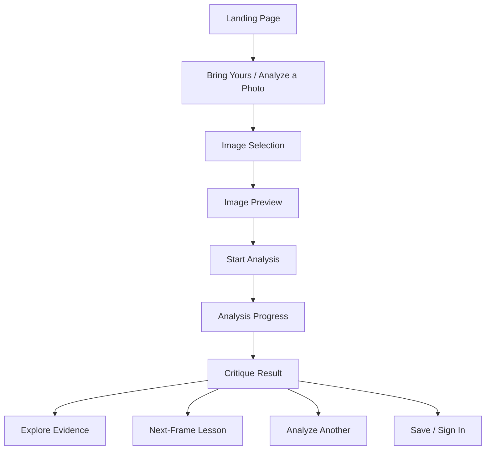
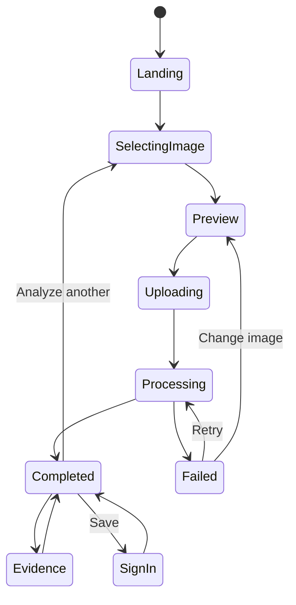

# Snapgrade — App Flow

**Status:** Draft v1  
**Purpose:** Define the user-visible flow from landing page to completed photography critique.

---

## 1. Experience Principle

Snapgrade should feel like a guided visual reading of a photograph.

The app must avoid this pattern:

> Upload → spinner → score.

The preferred pattern is:

> Upload → observe → understand → act.

---

## 2. Top-Level Flow



---

## 3. Landing Page Flow

The landing page is an explanation of how Snapgrade thinks.

### 3.1 Hero

Goal:
- Establish that photographs contain visual decisions.
- Make the user curious about how those choices can be read.

Requirements:
- Clear primary CTA.
- No score-first language.
- Image overlays should reveal meaningful photographic relationships.
- Overlay sequence can animate automatically once in view.

Primary CTA:

> Bring yours

or equivalent approved copy.

### 3.2 Transition into “The Read”

The transition must make it clear that the page is moving from:

> “There are choices inside the frame”

to:

> “Here is how Snapgrade reads those choices.”

Avoid:
- Reusing the exact hero layout.
- A long pinned scroll with words repeatedly appearing/disappearing.
- Blank screens between sections.

### 3.3 The Read

Goal:
Explain the analysis model using one photograph without making the whole section about that photograph.

Narrative:
- Visual hierarchy.
- Light.
- Composition.
- Subject separation.
- Color.
- Context / intent.

The image can have controlled scroll-linked motion while text remains readable.

### 3.4 Beyond the Score

Core message:

> Every image has a reason.

Purpose:
- Explain that Snapgrade evaluates decisions, not only a single number.

### 3.5 Adaptive Analysis

Message:

> Different frames need different questions.

Examples:
- A street image can tolerate motion that would hurt a product photo.
- Centered composition can be intentional.
- Deep shadow may be mood, not a technical failure.

### 3.6 Growth Loop

Explain:

```text
Shoot
  ↓
Read the frame
  ↓
Understand the decision
  ↓
Try again with intent
```

The section should communicate learning, not gamification.

### 3.7 CTA

The CTA should feel like the final invitation after the product has taught the user how it works.

User action:
- Click “Bring yours.”
- Navigate to `/analyze` or open the upload experience.

### 3.8 Footer

The footer closes the narrative.

Brand statement:

> See more. Understand better.

---

## 4. Analyze Flow

Route:

```text
/analyze
```

### 4.1 Empty upload state

Show:

- Large drop zone / image picker.
- Short explanation.
- Supported format hint.
- Privacy / retention link if relevant.

Primary action:

> Choose a photograph

Secondary:
- Drag and drop.
- Mobile photo picker.

### 4.2 File selected

Immediately show a preview.

Display:

- Image.
- Filename only if useful.
- Remove / replace.
- Analyze button.

Optional lightweight validation messaging:

- Unsupported format.
- File too large.
- Could not decode image.

Do not begin paid analysis before explicit start unless product intentionally uses auto-start.

### 4.3 Uploading

User sees:

- Image thumbnail/preview.
- Upload progress.
- Cancel if technically supported.

Transition as soon as server has accepted the image.

---

## 5. Analysis Progress Flow

Route can remain:

```text
/analyze
```

or transition to:

```text
/analysis/{analysis_id}
```

Preferred: transition to the stable analysis URL immediately after an analysis ID exists.

### 5.1 Progress stages

Suggested user-facing stages:

1. **Reading the frame**
2. **Finding visual weight**
3. **Checking light and structure**
4. **Understanding the subject**
5. **Building the critique**

The exact internal pipeline may differ.

### 5.2 Progress behavior

Requirements:

- Never show a fake exact percentage unless backed by real work.
- Stage changes should map to real pipeline states.
- Keep the selected image visible.
- Allow the user to understand that analysis is still active.
- If processing takes longer than normal, change copy rather than freezing the UI.

### 5.3 Failure

Recoverable external failure:

> The critique service did not finish this pass.

Actions:
- Retry.
- Return to image.
- Choose another image.

Do not require a second upload when the existing asset is valid.

---

## 6. Result Flow

Route:

```text
/analysis/{analysis_id}
```

### 6.1 Initial result hierarchy

Above the fold:

1. Photograph.
2. “The Read” summary.
3. Most important strength.
4. Most important tension.
5. Next-frame lesson.

The result should be useful before the user expands anything.

---

## 7. The Read

A short editorial interpretation.

Example structure:

```text
The frame is organized around the face, but the brightest area sits behind the shoulder.
That gives the image energy, while also splitting attention between the expression and the background.
```

Requirements:

- Specific.
- Concise.
- Avoid generic praise.
- Avoid declaring intent as fact when uncertain.

---

## 8. What Works

Show 2–4 high-impact strengths.

Each item may contain:

- Short title.
- Explanation.
- Evidence tag.
- Optional “show on image.”

Example:

```text
Strong subject separation

The face stays distinct even though the background is busy because local contrast is highest around the eyes and cheek.
```

---

## 9. What Competes

Show 1–3 meaningful tensions.

Use “competes,” “weakens,” or “reduces clarity” where appropriate rather than treating every observation as an error.

Example:

```text
A second visual anchor

The bright sign near the top-right edge pulls attention away from the subject after the first glance.
```

---

## 10. Image Evidence Interaction

User can tap/click:

> Show on image

The image transitions to an evidence overlay.

Possible overlays:

- Bounding region.
- Heatmap.
- Guide line.
- Edge highlight.
- Subject mask.
- Tonal warning region.

Rules:

- One observation should map to one understandable overlay.
- Do not show every CV artifact at once.
- Overlay styling must not obscure the photograph.
- The user should be able to turn overlays off.

---

## 11. Dimension Explorer

Below the primary read, show deeper dimensions.

Possible cards:

```text
Composition
Visual hierarchy
Light
Color
Subject separation
Technical clarity
```

Each card has:

- State: strength / mixed / needs attention / neutral.
- 1–2 sentence summary.
- Expand action.

Do not use traffic-light coloring as the only information carrier.

---

## 12. Expanded Dimension

Example:

### Composition

```text
The frame is weighted to the lower-left because the subject and strongest contrast occupy the same region.
The open space on the right gives the subject somewhere to look into, which helps the imbalance feel intentional.
```

Evidence:
- Subject centroid.
- Empty-space region.
- Dominant line.

Next question:
> What happens if you keep the empty space but remove the bright edge element?

This makes the critique instructional.

---

## 13. Next-Frame Lesson

This is one of the most important product components.

It should be:

- Specific.
- Achievable.
- Based on the current photograph.
- Written as something the user can try during the next shoot.

Bad:

> Improve composition.

Good:

> Keep the subject in the same position, but move half a step left so the bright sign no longer touches the head.

The lesson can include:

- **Keep**
- **Change**
- **Watch for**

Example:

```text
Keep:
The low viewpoint.

Change:
Give the subject slightly more separation from the bright background.

Watch for:
Small bright objects entering near the frame edge.
```

---

## 14. Optional Score Flow

If score remains enabled:

- Place it below the explanatory critique.
- Use it as summary metadata, not headline.
- Explain the contributing dimensions.
- Avoid decimal precision.

Preferred:

```text
Overall read: Strong foundation
```

instead of:

```text
8.37 / 10
```

---

## 15. Analyze Another

After the user has consumed the result:

Primary repeat action:

> Analyze another frame

This returns to the upload state.

If logged in:
- Keep history.

If anonymous:
- Preserve current result during the session if retention policy allows.

---

## 16. Sign-In / Save Flow

Anonymous users can receive a critique without an account.

After result:

> Save this critique

If authentication is required to save:
- Open sign-in.
- After success, attach eligible current anonymous analysis to the account.
- Return to the same result, not a dashboard.

---

## 17. History Flow

Future / account feature.

Route:

```text
/history
```

Display:

- Thumbnail.
- Analysis date.
- Main lesson.
- Genre.
- Optional recurring pattern.

Click opens the original result.

Avoid reducing history to a list of scores.

---

## 18. Mobile Flow

Mobile is a first-class use case.

Requirements:

- Native image picker.
- Large tap targets.
- Result text never overlays the image in a way that hides critical content.
- Evidence overlays must scale with the displayed image.
- Sticky controls should not consume excessive viewport height.
- Landing-page pinned animations must degrade cleanly on small screens.

Recommended result order on mobile:

```text
Image
The Read
Next-frame lesson
What works
What competes
Dimension explorer
```

---

## 19. Accessibility Flow

- Full keyboard operation for upload and result controls.
- `alt` text for interface imagery where appropriate.
- Analysis overlays require textual equivalents.
- Do not encode strength/issues only by color.
- Respect reduced motion.
- Maintain readable contrast.
- Focus returns to a meaningful element after modal/overlay interactions.

---

## 20. Error and Edge Cases

### Unsupported image

Action:
- Explain supported formats.
- Keep picker available.

### Very large image

Action:
- If safe, downscale server-side.
- Otherwise clearly request a smaller export.

### Corrupted image

Action:
- Reject before analysis.
- Explain that the file could not be decoded.

### No obvious subject

Snapgrade should not force a subject.

Result can say:

> The frame reads more as a field of shapes and light than as a single-subject composition.

### Multiple subjects

The analysis should discuss hierarchy between them.

### Intentional blur

Do not automatically classify blur as failure.

Use semantic context plus local metrics.

### Extreme high-key / low-key

Avoid generic exposure warnings when the tonal treatment appears intentional.

### AI reasoning fails

If local analysis succeeded:
- Preserve the uploaded asset.
- Retry only the semantic stage.
- Do not restart the entire pipeline unless necessary.

---

## 21. User Flow State Model



---

## 22. Recommended Route Map

```text
/                       Landing
/analyze                Upload entry
/analysis/[id]          Progress + result
/history                Saved analyses
/settings               Account/privacy settings
/privacy                Privacy policy
/terms                  Terms
/license                Open-source / asset license information if applicable
```

---

## 23. Product Copy Rules

Snapgrade copy should prefer:

- “read”
- “notice”
- “visual weight”
- “choice”
- “decision”
- “competes”
- “supports”
- “separation”
- “attention”
- “try next”

Use carefully:

- “score”
- “perfect”
- “correct”
- “wrong”
- “bad composition”
- “AI thinks”

The product voice should sound like an experienced critique partner, not an automated judge.
