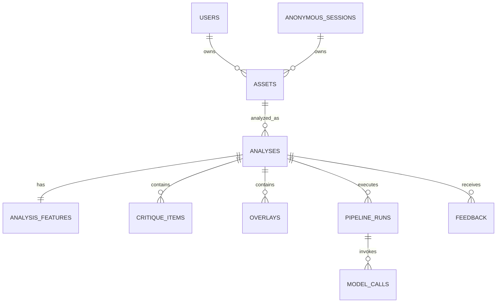

# Snapgrade — Backend Schema

**Status:** Proposed canonical schema v1  
**Database:** PostgreSQL  
**Design goal:** Preserve structured visual evidence, critique output, pipeline versions, and cost telemetry without coupling the database to one model provider.

---

## 1. Schema Principles

- Use UUID primary keys.
- Keep uploaded image identity separate from analysis runs.
- Store local CV output separately from user-facing critique.
- Preserve normalized image coordinates in the range `0.0–1.0`.
- Version every pipeline/model-dependent artifact.
- Prefer normalized relational records for queryable entities and JSONB for evolving feature bundles.
- Never store raw secrets or provider credentials in application tables.
- Make anonymous use possible without weakening ownership controls.

---

## 2. Entity Relationship Overview



---

## 3. `users`

Use only if account functionality is enabled.

```sql
CREATE TABLE users (
    id UUID PRIMARY KEY,
    auth_provider TEXT NOT NULL,
    auth_subject TEXT NOT NULL,
    email TEXT,
    display_name TEXT,
    created_at TIMESTAMPTZ NOT NULL DEFAULT now(),
    updated_at TIMESTAMPTZ NOT NULL DEFAULT now(),
    deleted_at TIMESTAMPTZ,
    UNIQUE (auth_provider, auth_subject)
);
```

Notes:
- Authentication provider remains authoritative for credentials.
- Do not store password hashes if using managed auth.
- `email` can be nullable if provider privacy settings require it.

---

## 4. `anonymous_sessions`

Allows account-free analysis.

```sql
CREATE TABLE anonymous_sessions (
    id UUID PRIMARY KEY,
    token_hash TEXT NOT NULL UNIQUE,
    created_at TIMESTAMPTZ NOT NULL DEFAULT now(),
    last_seen_at TIMESTAMPTZ NOT NULL DEFAULT now(),
    expires_at TIMESTAMPTZ NOT NULL,
    converted_to_user_id UUID REFERENCES users(id),
    deleted_at TIMESTAMPTZ
);
```

Store only a hash of the session token.

---

## 5. `assets`

Represents an uploaded photograph.

```sql
CREATE TABLE assets (
    id UUID PRIMARY KEY,

    user_id UUID REFERENCES users(id),
    anonymous_session_id UUID REFERENCES anonymous_sessions(id),

    original_filename TEXT,
    source_mime_type TEXT,
    normalized_mime_type TEXT NOT NULL,

    width_px INTEGER NOT NULL,
    height_px INTEGER NOT NULL,
    megapixels NUMERIC(8,2),

    byte_size BIGINT,
    sha256 TEXT NOT NULL,
    perceptual_hash TEXT,

    storage_original_key TEXT,
    storage_normalized_key TEXT NOT NULL,
    storage_thumbnail_key TEXT,

    exif JSONB,
    exif_retained BOOLEAN NOT NULL DEFAULT false,

    created_at TIMESTAMPTZ NOT NULL DEFAULT now(),
    deleted_at TIMESTAMPTZ,

    CHECK (
        (user_id IS NOT NULL AND anonymous_session_id IS NULL)
        OR
        (user_id IS NULL AND anonymous_session_id IS NOT NULL)
    )
);
```

Indexes:

```sql
CREATE INDEX idx_assets_user_created
ON assets(user_id, created_at DESC);

CREATE INDEX idx_assets_anon_created
ON assets(anonymous_session_id, created_at DESC);

CREATE INDEX idx_assets_sha256
ON assets(sha256);
```

---

## 6. `analyses`

One asset may have multiple analyses as the pipeline evolves.

```sql
CREATE TYPE analysis_status AS ENUM (
    'created',
    'uploaded',
    'preprocessing',
    'local_analysis',
    'semantic_analysis',
    'validating',
    'completed',
    'failed'
);

CREATE TABLE analyses (
    id UUID PRIMARY KEY,
    asset_id UUID NOT NULL REFERENCES assets(id),

    status analysis_status NOT NULL DEFAULT 'created',
    failure_code TEXT,
    failure_message TEXT,
    retryable BOOLEAN,

    pipeline_version TEXT NOT NULL,
    response_schema_version TEXT NOT NULL,

    primary_genre TEXT,
    genre_confidence REAL,
    subject_summary TEXT,

    read_summary TEXT,
    next_frame_title TEXT,
    next_frame_instruction TEXT,

    overall_enabled BOOLEAN NOT NULL DEFAULT false,
    overall_band TEXT,

    warnings JSONB NOT NULL DEFAULT '[]'::jsonb,

    started_at TIMESTAMPTZ,
    completed_at TIMESTAMPTZ,
    created_at TIMESTAMPTZ NOT NULL DEFAULT now(),
    updated_at TIMESTAMPTZ NOT NULL DEFAULT now()
);
```

Indexes:

```sql
CREATE INDEX idx_analyses_asset_created
ON analyses(asset_id, created_at DESC);

CREATE INDEX idx_analyses_status
ON analyses(status);

CREATE INDEX idx_analyses_completed
ON analyses(completed_at DESC)
WHERE status = 'completed';
```

---

## 7. `analysis_features`

Stores local CV output.

One row per analysis is recommended for MVP.

```sql
CREATE TABLE analysis_features (
    analysis_id UUID PRIMARY KEY REFERENCES analyses(id) ON DELETE CASCADE,

    feature_bundle_version TEXT NOT NULL,

    image_features JSONB NOT NULL DEFAULT '{}'::jsonb,
    exposure_features JSONB NOT NULL DEFAULT '{}'::jsonb,
    color_features JSONB NOT NULL DEFAULT '{}'::jsonb,
    sharpness_features JSONB NOT NULL DEFAULT '{}'::jsonb,
    saliency_features JSONB NOT NULL DEFAULT '{}'::jsonb,
    subject_features JSONB NOT NULL DEFAULT '[]'::jsonb,
    face_features JSONB NOT NULL DEFAULT '[]'::jsonb,
    geometry_features JSONB NOT NULL DEFAULT '{}'::jsonb,
    depth_features JSONB,
    quality_flags JSONB NOT NULL DEFAULT '[]'::jsonb,

    module_versions JSONB NOT NULL DEFAULT '{}'::jsonb,

    created_at TIMESTAMPTZ NOT NULL DEFAULT now(),
    updated_at TIMESTAMPTZ NOT NULL DEFAULT now()
);
```

### Example `exposure_features`

```json
{
  "mean_luminance": 0.43,
  "median_luminance": 0.39,
  "p05": 0.04,
  "p95": 0.91,
  "highlight_clip_ratio": 0.008,
  "shadow_clip_ratio": 0.021,
  "global_contrast": 0.61
}
```

### Example `subject_features`

```json
[
  {
    "id": "subject_1",
    "label": "person",
    "confidence": 0.93,
    "bbox": [0.19, 0.17, 0.55, 0.91],
    "saliency_mean": 0.74,
    "sharpness": 0.67
  }
]
```

---

## 8. `critique_items`

Stores individual structured observations.

```sql
CREATE TYPE critique_kind AS ENUM (
    'strength',
    'tension',
    'dimension',
    'lesson_support'
);

CREATE TYPE support_level AS ENUM (
    'supported',
    'partially_supported',
    'semantic_only',
    'conflicted'
);

CREATE TABLE critique_items (
    id UUID PRIMARY KEY,
    analysis_id UUID NOT NULL REFERENCES analyses(id) ON DELETE CASCADE,

    kind critique_kind NOT NULL,
    dimension TEXT NOT NULL,

    title TEXT NOT NULL,
    body TEXT NOT NULL,

    impact_rank INTEGER,
    confidence REAL,

    support support_level NOT NULL,
    evidence JSONB NOT NULL DEFAULT '[]'::jsonb,

    display_order INTEGER NOT NULL DEFAULT 0,
    created_at TIMESTAMPTZ NOT NULL DEFAULT now()
);
```

Suggested dimensions:

```text
composition
visual_hierarchy
subject_clarity
light
exposure
color
separation
technical_clarity
edge_control
depth
gesture
motion
geometry
context
```

Example evidence:

```json
[
  {
    "type": "saliency_region",
    "region_id": "saliency_2",
    "strength": 0.84
  },
  {
    "type": "metric",
    "path": "exposure_features.highlight_clip_ratio",
    "value": 0.008
  },
  {
    "type": "semantic",
    "text": "The sign creates a secondary high-contrast anchor."
  }
]
```

---

## 9. `overlays`

Stores user-visible evidence geometry.

```sql
CREATE TYPE overlay_type AS ENUM (
    'bbox',
    'polygon',
    'line',
    'point',
    'heatmap',
    'mask'
);

CREATE TABLE overlays (
    id UUID PRIMARY KEY,
    analysis_id UUID NOT NULL REFERENCES analyses(id) ON DELETE CASCADE,
    critique_item_id UUID REFERENCES critique_items(id) ON DELETE SET NULL,

    overlay_type overlay_type NOT NULL,
    label TEXT,

    geometry JSONB NOT NULL,
    style_hint JSONB,
    derived_asset_key TEXT,

    display_order INTEGER NOT NULL DEFAULT 0,
    created_at TIMESTAMPTZ NOT NULL DEFAULT now()
);
```

### Geometry examples

Bounding box:

```json
{
  "bbox": [0.71, 0.10, 0.92, 0.36]
}
```

Line:

```json
{
  "start": [0.05, 0.52],
  "end": [0.96, 0.48]
}
```

Polygon:

```json
{
  "points": [
    [0.10, 0.10],
    [0.30, 0.12],
    [0.29, 0.40],
    [0.12, 0.39]
  ]
}
```

Coordinates are normalized to the orientation-corrected analysis image.

---

## 10. `pipeline_runs`

Stores stage execution.

```sql
CREATE TABLE pipeline_runs (
    id UUID PRIMARY KEY,
    analysis_id UUID NOT NULL REFERENCES analyses(id) ON DELETE CASCADE,

    stage TEXT NOT NULL,
    implementation TEXT NOT NULL,
    version TEXT NOT NULL,

    status TEXT NOT NULL,
    attempt INTEGER NOT NULL DEFAULT 1,

    started_at TIMESTAMPTZ NOT NULL,
    finished_at TIMESTAMPTZ,
    duration_ms INTEGER,

    error_code TEXT,
    error_detail TEXT,

    metadata JSONB NOT NULL DEFAULT '{}'::jsonb
);
```

Example stages:

```text
preprocess
exposure
color
sharpness
saliency
subjects
faces
geometry
depth
genre
semantic_reasoning
consistency_validation
```

---

## 11. `model_calls`

Tracks external or local learned-model inference.

```sql
CREATE TABLE model_calls (
    id UUID PRIMARY KEY,
    pipeline_run_id UUID NOT NULL REFERENCES pipeline_runs(id) ON DELETE CASCADE,

    provider TEXT NOT NULL,
    model TEXT NOT NULL,
    model_version TEXT,

    call_type TEXT NOT NULL,
    request_hash TEXT,
    cached BOOLEAN NOT NULL DEFAULT false,

    input_units BIGINT,
    output_units BIGINT,
    image_units BIGINT,

    estimated_cost_usd NUMERIC(12,6),

    latency_ms INTEGER,
    status TEXT NOT NULL,

    provider_request_id TEXT,
    error_code TEXT,

    created_at TIMESTAMPTZ NOT NULL DEFAULT now()
);
```

Do not store provider API keys.

Raw prompts/responses should not be stored by default. If debug retention is enabled, use a separate access-controlled system with a short TTL.

---

## 12. `feedback`

```sql
CREATE TABLE feedback (
    id UUID PRIMARY KEY,
    analysis_id UUID NOT NULL REFERENCES analyses(id) ON DELETE CASCADE,

    user_id UUID REFERENCES users(id),
    anonymous_session_id UUID REFERENCES anonymous_sessions(id),

    useful BOOLEAN,
    rating INTEGER,
    reason_codes JSONB NOT NULL DEFAULT '[]'::jsonb,
    comment TEXT,

    created_at TIMESTAMPTZ NOT NULL DEFAULT now(),

    CHECK (rating IS NULL OR (rating >= 1 AND rating <= 5))
);
```

Possible reason codes:

```text
too_generic
incorrect_subject
technical_claim_wrong
not_actionable
too_harsh
too_long
overlay_wrong
helpful_composition
helpful_light
helpful_next_step
```

---

## 13. Optional `learning_patterns`

Future account feature.

```sql
CREATE TABLE learning_patterns (
    id UUID PRIMARY KEY,
    user_id UUID NOT NULL REFERENCES users(id) ON DELETE CASCADE,

    pattern_key TEXT NOT NULL,
    title TEXT NOT NULL,
    description TEXT NOT NULL,

    evidence_count INTEGER NOT NULL DEFAULT 0,
    confidence REAL,

    first_seen_at TIMESTAMPTZ,
    last_seen_at TIMESTAMPTZ,

    status TEXT NOT NULL DEFAULT 'active',
    metadata JSONB NOT NULL DEFAULT '{}'::jsonb,

    UNIQUE (user_id, pattern_key)
);
```

Examples:

```text
edge_brightness_competition
weak_subject_separation
strong_negative_space
frequent_centered_framing
tilted_horizons
high_contrast_subjects
```

---

## 14. API Response Models

### Analysis summary

```json
{
  "analysis_id": "2f8d...",
  "status": "completed",
  "context": {
    "primary_genre": "street",
    "genre_confidence": 0.76,
    "subject_summary": "A pedestrian crossing a lit street."
  },
  "read": "The frame is organized around...",
  "strengths": [
    {
      "id": "uuid",
      "dimension": "subject_clarity",
      "title": "Clear first read",
      "body": "...",
      "confidence": 0.88,
      "overlay_ids": ["uuid"]
    }
  ],
  "tensions": [],
  "dimensions": [],
  "next_frame_lesson": {
    "title": "Protect the primary anchor",
    "instruction": "..."
  },
  "overall": {
    "enabled": false,
    "band": null
  },
  "warnings": [],
  "pipeline": {
    "pipeline_version": "1.0",
    "response_schema_version": "1.0"
  }
}
```

---

## 15. Internal Feature Bundle Model

Recommended internal typed shape:

```python
class FeatureBundle(BaseModel):
    version: str
    image: ImageFeatures
    exposure: ExposureFeatures
    color: ColorFeatures
    sharpness: SharpnessFeatures
    saliency: SaliencyFeatures
    subjects: list[SubjectFeature]
    faces: list[FaceFeature]
    geometry: GeometryFeatures
    depth: DepthFeatures | None = None
    quality_flags: list[QualityFlag] = []
    module_versions: dict[str, str]
```

---

## 16. Critique Item Model

```python
class CritiqueItem(BaseModel):
    id: UUID
    kind: Literal["strength", "tension", "dimension", "lesson_support"]
    dimension: str
    title: str
    body: str
    confidence: float | None
    support: Literal[
        "supported",
        "partially_supported",
        "semantic_only",
        "conflicted"
    ]
    evidence: list[Evidence]
    overlay_ids: list[UUID] = []
```

---

## 17. Evidence Model

```python
class Evidence(BaseModel):
    type: Literal[
        "metric",
        "region",
        "saliency_region",
        "subject",
        "face",
        "line",
        "semantic"
    ]
    source_id: str | None = None
    path: str | None = None
    value: object | None = None
    text: str | None = None
    confidence: float | None = None
```

---

## 18. Status Response

While processing:

```json
{
  "analysis_id": "uuid",
  "status": "local_analysis",
  "progress": {
    "stage": "finding_visual_weight",
    "completed_stages": [
      "upload",
      "preprocessing"
    ]
  }
}
```

Do not expose fake numeric completion percentages unless the processing system can calculate them accurately.

---

## 19. Storage Lifecycle

Recommended defaults to make configurable:

### Anonymous

- Original: optionally discard immediately after normalized derivative exists.
- Normalized image: retain for a short period such as 24 hours or product-defined TTL.
- Analysis: retain for same period unless user saves via account.

### Account

- Retain until user deletes, subject to product policy.
- Delete derived artifacts with the parent asset.

Use soft-delete in database for immediate product removal, then asynchronous hard-delete in storage.

---

## 20. Deletion Semantics

Deleting an asset should eventually remove:

- Original object.
- Normalized object.
- Thumbnail.
- Derived maps.
- Analyses.
- Feature bundles.
- Critique items.
- Overlays.
- Feedback linkage where policy permits.

Prefer a deletion job with audit status rather than assuming object storage deletion cannot fail.

---

## 21. Ownership Rules

### Authenticated

```text
asset.user_id == authenticated_user.id
```

### Anonymous

```text
asset.anonymous_session_id == validated_session.id
```

Never authorize by analysis ID alone.

---

## 22. Caching Schema

Optional table if shared persistent caching is required:

```sql
CREATE TABLE analysis_cache (
    id UUID PRIMARY KEY,

    image_sha256 TEXT NOT NULL,
    pipeline_version TEXT NOT NULL,
    feature_bundle_version TEXT NOT NULL,
    prompt_version TEXT NOT NULL,
    model TEXT NOT NULL,

    result JSONB NOT NULL,

    created_at TIMESTAMPTZ NOT NULL DEFAULT now(),
    expires_at TIMESTAMPTZ,

    UNIQUE (
        image_sha256,
        pipeline_version,
        feature_bundle_version,
        prompt_version,
        model
    )
);
```

Only use shared cache if reuse is compatible with privacy policy.

---

## 23. Migration Strategy

Use Alembic or the migration system appropriate to the backend ORM.

Rules:

- Never mutate production schema manually.
- All migrations are reviewed.
- Add nullable columns before backfills.
- Avoid blocking rewrites on large tables.
- Keep API backward-compatible during rolling deployment.
- Store `response_schema_version` so old result rows remain readable.

---

## 24. Suggested Initial Database Scope

For the first usable release, implement only:

```text
anonymous_sessions
assets
analyses
analysis_features
critique_items
overlays
pipeline_runs
model_calls
feedback
```

Add `users` once account persistence is enabled.

Add `learning_patterns` only after history is valuable enough to justify pattern aggregation.

---

## 25. Example Analysis Record

```json
{
  "analysis": {
    "id": "8f6e58a9-...",
    "asset_id": "a95b2d12-...",
    "status": "completed",
    "pipeline_version": "1.0.0",
    "response_schema_version": "1.0.0",
    "primary_genre": "street",
    "genre_confidence": 0.78,
    "subject_summary": "A pedestrian moving through a bright urban intersection.",
    "read_summary": "The subject is clear on first glance, but a bright sign on the right becomes a competing second anchor.",
    "next_frame_title": "Protect the first read",
    "next_frame_instruction": "Keep the viewpoint, but shift enough to separate the subject from the brightest sign."
  },
  "features": {
    "highlight_clip_ratio": 0.006,
    "subject_bbox": [0.21, 0.19, 0.53, 0.90],
    "primary_saliency_region": [0.22, 0.18, 0.55, 0.74],
    "secondary_saliency_region": [0.72, 0.08, 0.94, 0.33]
  }
}
```

---

## 26. Schema Decision Summary

The key architectural decision is to keep these concepts separate:

```text
IMAGE
  ≠
LOCAL MEASUREMENTS
  ≠
MODEL INTERPRETATION
  ≠
USER-FACING CRITIQUE
```

That separation gives Snapgrade:

- Better debugging.
- Lower model cost.
- Safer caching.
- Easier model upgrades.
- Stronger consistency checks.
- Better evidence overlays.
- A clean path toward more local deep-learning inference later.
