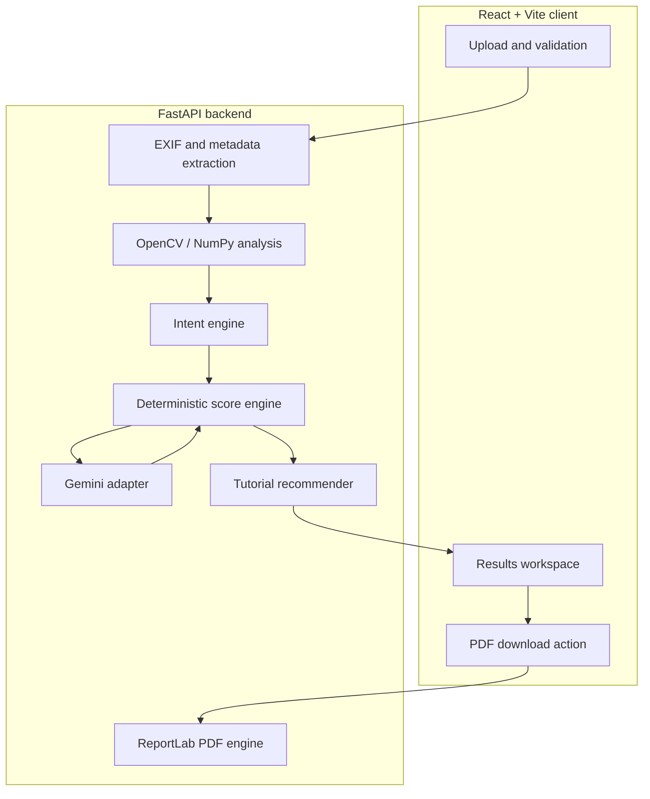

# FocalPointAI Project Report

**Report date:** July 18, 2026  
**Project stage:** Functional MVP / pre-release beta  
**Assessment basis:** Current repository implementation and local automated verification

## 1. Executive Summary

FocalPointAI is an AI-assisted photography critique platform. A user uploads a photograph and receives a structured evaluation covering technical quality, composition, color, subject placement, photographic intent, improvement opportunities, and targeted learning material. The application can also export the critique as a branded multi-page PDF.

The current repository contains a working React frontend and FastAPI backend. The primary analysis path is intentionally hybrid: OpenCV, NumPy, Pillow, and EXIF parsing produce local evidence and deterministic scores; Gemini is optional and is limited to explaining the application-computed results. If Gemini is unavailable, not configured, rate-limited, or fails, the application continues using local computer vision.

The MVP is technically coherent and its automated baseline is healthy. On July 18, 2026, all 19 backend tests passed, frontend lint passed, and the production frontend build completed successfully. The main remaining work is release hardening: server-side input limits, deployment-safe configuration, restricted CORS, dependency pinning, continuous integration, live provider testing, and end-to-end validation with representative photographs.

## 2. Project Objectives

The product aims to:

1. Make photography critique accessible and actionable for developing photographers.
2. Base feedback on measurable image evidence rather than unsupported AI claims.
3. Continue providing useful results when a cloud AI provider is unavailable.
4. Connect identified weaknesses to specific learning resources and practice topics.
5. Turn an on-screen analysis into a portable, professional PDF critique.

## 3. Current Product Scope

### 3.1 Delivered user capabilities

- Upload or drag and drop JPEG, PNG, and WebP photographs.
- Validate file type and a 15 MB limit in the frontend.
- Preview the photograph, file size, dimensions, and available camera identity before analysis.
- Use one of three remotely hosted demonstration photographs.
- View a staged analysis progress experience.
- Receive an overall score and category-level feedback for composition, lighting, focus, color, subject/story, and post-processing.
- Review strengths, quick wins, improvement guidance, and intent-aware technique evaluations.
- Inspect visual evidence such as subject location and selected composition signals.
- View EXIF camera settings when embedded in the source photograph.
- Receive up to three ranked tutorials tied to the weakest relevant areas.
- Watch recommended YouTube content from the results workspace.
- Download a multi-page PDF critique containing the photograph, scores, recommendations, and tutorial links.
- Start a new analysis without restarting the application.

### 3.2 Configuration-dependent capability

When `GEMINI_API_KEY` is set, the backend sends the image and a compact evidence context to the configured Gemini model. Gemini supplies narrative feedback. The score engine then reapplies the local authoritative scores and EXIF evidence so provider output cannot silently alter the application's measurements.

Without the key, or when the request fails, the API returns the local critique and records a stable AI status such as `not_configured`, `rate_limited`, `authentication_error`, `timeout`, `service_unavailable`, or `failed`.

### 3.3 Present but not active

`backend/emailing_engine.py` contains email-rendering and SMTP support, but the current API and frontend do not expose an email-report workflow. The active reporting feature is direct PDF download.

### 3.4 Out of current scope

- RAW image decoding and preview generation
- User accounts, authorization, and profiles
- Database persistence and analysis history
- Cloud image storage
- Batch analysis and portfolio review
- Generated crop coordinates and interactive crop previews
- Exportable Lightroom presets
- Progress tracking, challenges, and community features
- Production monitoring, job queues, and administrative tools

## 4. User Journey

1. The user selects a local image or a demonstration photograph.
2. The frontend validates the declared image type and file size.
3. The frontend requests lightweight camera metadata and displays the prepared upload.
4. The user starts the analysis.
5. The backend extracts EXIF data and runs memory-bounded local computer vision.
6. The intent and score engines convert evidence into technique assessments and authoritative scores.
7. If configured, Gemini generates narrative feedback from the image and evidence context.
8. The backend enforces the local scores, ranks learning resources, and returns the result.
9. The frontend displays the critique workspace.
10. The user may download a PDF or begin another analysis.

## 5. Technical Architecture

### 5.1 Frontend

The frontend uses React 19 and Vite 8. Most application state, request handling, result transformation, and view rendering currently live in `frontend/src/App.jsx`; the visual system is primarily contained in `frontend/src/index.css` and `frontend/src/App.css`. Lucide React supplies icons.

The client uses `VITE_BACKEND_URL` when defined and otherwise targets `http://127.0.0.1:8000`. This is convenient locally but must be explicitly configured in deployment.

### 5.2 Backend

FastAPI exposes six routes:

| Method | Route | Responsibility |
| --- | --- | --- |
| `GET` | `/` | Health response |
| `POST` | `/image-metadata` | Lightweight EXIF camera identification |
| `POST` | `/analyze` | Complete image-analysis workflow |
| `POST` | `/critique-pdf` | PDF generation from an existing result |
| `GET` | `/tutorials` | Curated tutorial catalog |
| `POST` | `/tutorial-recommendations` | Tutorial ranking for an analysis payload |

### 5.3 Local analysis

The local engine resizes oversized working images to a maximum analysis dimension of 1,600 pixels while retaining original dimensions in the response. It computes evidence for brightness, contrast, saturation, sharpness, faces and eyes, subject centering, horizon, background clutter, saliency, color palette, sky, and multiple composition concepts.

Bundled Haar cascade files support face and eye detection without a required runtime download. If those files are absent, the engine can attempt to retrieve them, which should be removed or controlled for fully offline production environments.

### 5.4 Scoring and intent

The intent engine interprets technique use in context. It can avoid penalizing an intentional absence, such as very low color saturation in a monochrome minimalist image. The score engine turns local findings into bounded categories and an overall score, builds the compact context sent to Gemini, and reapplies authoritative values after the provider response.

### 5.5 Tutorial recommendations

Tutorial selection is deterministic and operates on the local `tutorials_catalog.json` file. Recommendations are ranked using weak categories, photographic intent, visual evidence gates, learner level, and uniqueness. The application does not require a YouTube API key.

### 5.6 PDF reports

The ReportLab engine generates a branded multi-page A4 critique. It can embed the analyzed photo with EXIF orientation applied, show category summaries and improvement guidance, and include links or QR codes for ranked tutorials. A safe filename is generated from the source image name.

## 6. Data and Integration Boundaries

- Local mode keeps analysis inside the running backend process.
- Gemini mode sends the uploaded image and application-computed context to Google's API.
- Demonstration images are retrieved from Unsplash by the browser.
- Tutorial playback, thumbnails, and links depend on YouTube services.
- No application database or cloud object store is present.
- Uploaded images and analysis results are not intentionally persisted by the active API.

These boundaries require an explicit privacy notice, provider disclosure, and retention policy before public release.

## 7. Verification Results

The following checks were executed locally on July 18, 2026:

| Check | Result | Evidence |
| --- | --- | --- |
| Backend unit and API-focused tests | Passed | 19 of 19 tests passed in 1.43 seconds |
| Frontend lint | Passed | `npm run lint` completed without findings |
| Frontend production build | Passed | Vite transformed 1,773 modules and built successfully |
| Production bundle | Built | 241.58 kB JavaScript and 44.87 kB CSS before gzip |

Existing backend coverage includes:

- Analysis image resizing and dimension preservation
- Gemini error classification
- Camera make/model normalization and metadata endpoint behavior
- Intent-aware monochrome/minimalist evaluation
- PDF generation, embedded photo orientation, filenames, endpoint response, and tutorial links
- Score ownership and compact Gemini context
- Tutorial catalog loading, ranking, bounds, uniqueness, and visual-evidence gating

### Verification not completed in this assessment

- A live Gemini request using a real API key and quota
- A full `/analyze` smoke test with a representative real photograph
- Browser-level end-to-end and accessibility testing
- Cross-browser and mobile-device testing
- Performance and memory profiling across large image dimensions
- Security, malformed-file, and adversarial-image testing
- Production deployment and network configuration

## 8. Risks and Technical Debt

### High priority

1. **The main analysis route lacks a server-side byte limit.** A direct caller can bypass the frontend's 15 MB check and cause `/analyze` to read a larger request into memory.
2. **CORS is permissive.** All origins, methods, and headers are allowed. Production should use a configured allowlist.
3. **Production API configuration can point to localhost.** If `VITE_BACKEND_URL` is omitted during deployment, the browser targets the visitor's own machine.
4. **Provider behavior is not live-verified.** The configured Gemini model, account access, response format, and quota must be tested before release.
5. **Privacy behavior is undocumented in-product.** Users need clear consent and provider disclosure when images are sent to Gemini.

### Medium priority

6. **Core files are large.** `App.jsx` is approximately 2,192 lines, `index.css` 2,545 lines, and `local_cv_engine.py` 898 lines. Component and service extraction would reduce regression risk.
7. **Backend dependencies are unpinned.** Recreating the environment can install different package versions.
8. **No continuous integration is present.** Passing tests, lint, and build are not automatically required for changes.
9. **API schemas are largely implicit.** Typed request and response models would improve validation and contract stability.
10. **Heuristic accuracy is not benchmarked.** Deterministic scores still need comparison with a labeled set and expert photographer assessments.
11. **Remote demo images introduce availability and CORS dependencies.** Local sample assets would make demonstrations reproducible.
12. **Legacy email code increases ambiguity.** It should be reconnected with a clear product workflow or archived after its useful templates are retained.

## 9. Roadmap Assessment

| Roadmap area | Current state |
| --- | --- |
| Core critique MVP | Implemented; requires release hardening |
| Phase 1: EXIF and RAW | EXIF substantially implemented; RAW support not implemented |
| Phase 2: Enhanced CV | Substantially implemented as heuristics; validation and calibration remain |
| Phase 3: Crop and Lightroom guidance | General edit suggestions exist; concrete crops and presets are not implemented |
| Phases 4-6: Auth, persistence, storage | Not implemented |
| Phases 7-9: Coach, progress, learning hub | Tutorial recommendations are an early learning feature; the broader phases are not implemented |
| Phases 10-11: Community and professional tools | Not implemented |

The existing `roadmap.md` describes the long-term direction but understates progress in enhanced computer vision. It should be updated to label work as shipped, beta, or planned.

## 10. Recommended Delivery Plan

### Priority 1: Establish a release-safe baseline

- Enforce upload byte, decoded-pixel, and image-dimension limits in every upload route.
- Validate actual image content instead of relying primarily on the declared MIME type.
- Replace wildcard CORS with environment-configured origins.
- Require `VITE_BACKEND_URL` for non-development builds.
- Pin Python dependencies and add automated dependency update management.
- Add CI jobs for backend tests, frontend lint, and frontend build.
- Add a small legal image-fixture set and a successful `/analyze` integration test.

### Priority 2: Validate the product claim

- Build a labeled evaluation set across portrait, landscape, street, architecture, macro, low-light, and intentionally unconventional images.
- Compare scores and advice with multiple experienced photographers.
- Measure false positives for faces, horizons, leading lines, framing, and negative space.
- Calibrate thresholds and introduce confidence indicators where appropriate.
- Profile analysis latency and peak memory for common phone and camera resolutions.

### Priority 3: Prepare external integrations

- Make the Gemini model identifier and timeout configurable.
- Run and document success, rate-limit, authentication, timeout, and malformed-response cases.
- Add user-facing disclosure and consent before cloud analysis.
- Replace remote demo dependencies with repository-owned or reliably hosted licensed samples.

### Priority 4: Improve maintainability

- Split the React application into upload, loading, summary, evidence, category, tutorial, and report components.
- Extract backend settings, EXIF handling, validation, and analysis orchestration into focused modules.
- Add typed Pydantic API schemas and centralized error responses.
- Decide whether the inactive email engine belongs in the next release.

### Priority 5: Resume roadmap feature work

- Complete RAW decoding and metadata normalization.
- Generate explicit crop coordinates, overlays, and before/after previews.
- Produce structured Lightroom adjustment guidance.
- Add accounts and persistence only after the analysis contract is stable.

## 11. Release Readiness Checklist

- [x] Local fallback analysis is implemented.
- [x] Gemini failures fall back to local results.
- [x] Application-owned scores are protected from provider output.
- [x] Frontend lint passes.
- [x] Frontend production build passes.
- [x] All current backend tests pass.
- [x] PDF critique generation is covered by tests.
- [ ] Full local `/analyze` integration test passes with a real fixture.
- [ ] Live Gemini success and failure paths are verified.
- [ ] Server-side upload and decoded-image limits are enforced.
- [ ] Production CORS and backend URL configuration are restricted.
- [ ] Backend dependencies are pinned.
- [ ] CI is required for changes.
- [ ] Browser end-to-end and accessibility testing pass.
- [ ] Privacy, consent, retention, and deletion behavior are documented.
- [ ] Production deployment smoke test passes.

## 12. Conclusion

FocalPointAI has progressed beyond a prototype: it has a coherent critique workflow, substantial local image analysis, guarded optional AI integration, personalized learning recommendations, and professional PDF output. Its strongest design decision is keeping measurable evidence and scores under application control while treating generative AI as an explanatory layer.

The project is ready for a focused hardening and validation cycle, not yet an unrestricted public release. Addressing input safety, deployment configuration, privacy, integration testing, and empirical CV validation will create a credible foundation for RAW support, concrete editing guidance, user accounts, and long-term coaching features.
