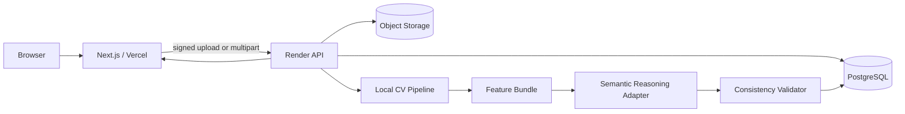
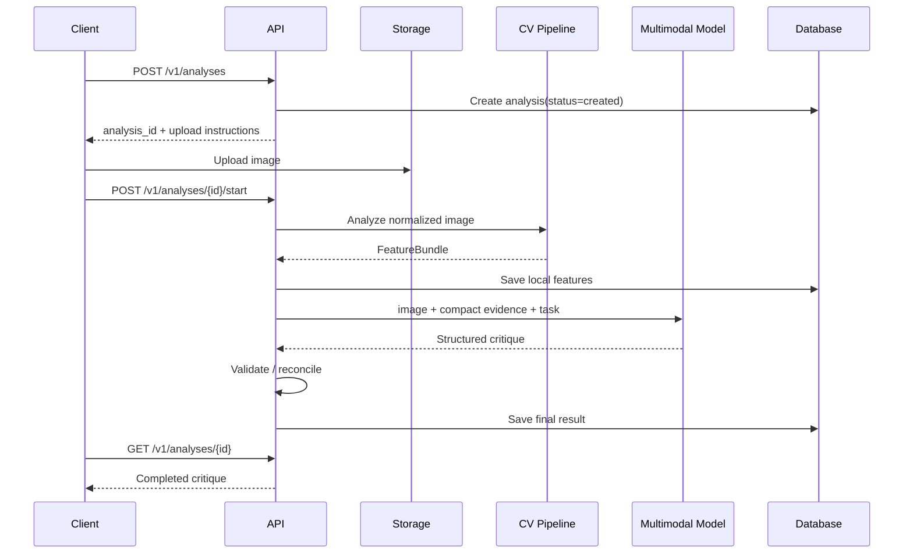

# Snapgrade — Technical Requirements Document (TRD)

**Status:** Draft v1  
**Scope:** Web app + image-analysis backend  
**Deployment baseline:** Frontend on Vercel, backend on Render  
**Architecture goal:** Reliable, low-cost, evidence-grounded photographic critique

---

## 1. Technical Objectives

The Snapgrade architecture should:

1. Keep the web experience responsive while image analysis runs.
2. Extract deterministic visual signals locally/server-side before using paid multimodal inference.
3. Produce one stable, typed critique schema.
4. Preserve evidence for every important critique claim.
5. Minimize repeated API inference through caching and idempotency.
6. Support future migration from external models toward self-hosted CV / deep-learning components.
7. Remain simple enough to operate at early-stage traffic.

---

## 2. Proposed Stack

### Frontend

- **Next.js** with App Router.
- **React**.
- **TypeScript**.
- **Tailwind CSS**.
- **Motion / motion.dev patterns** for the landing-page interactions.
- Server Components where useful.
- Client Components only for interactive upload, progress, image overlays, and result exploration.

### Backend

Recommended implementation target:

- **Python 3.12+**
- **FastAPI**
- **Pydantic v2**
- **Uvicorn/Gunicorn**
- **OpenCV**
- **Pillow**
- **NumPy**
- **scikit-image** where useful
- **PyTorch / ONNX Runtime** for learned local models
- **SQLAlchemy 2 / SQLModel** or equivalent
- **PostgreSQL**

If the currently deployed Render backend uses another Python web framework, preserve the API contracts in this document and adapt the framework-specific pieces rather than forcing a rewrite.

### Storage

- PostgreSQL for metadata and structured analysis.
- S3-compatible object storage for uploaded/normalized images and optional derived artifacts.
- Redis optional for:
  - short-lived cache,
  - rate limiting,
  - job state,
  - queueing.

### External intelligence

- Multimodal reasoning model accessed only from the backend.
- Provider must be abstracted behind one adapter interface.

---

## 3. High-Level Architecture



### Preferred processing flow



---

## 4. Frontend Architecture

Suggested app structure:

```text
src/
  app/
    page.tsx
    analyze/
      page.tsx
    analysis/
      [id]/
        page.tsx
    api/                # only if proxy/server actions are used
  components/
    landing/
    upload/
    analysis/
    overlays/
    ui/
  lib/
    api/
    analytics/
    image/
    types/
  styles/
```

### Frontend responsibilities

- Marketing and educational narrative.
- Image selection and validation hints.
- Upload progress.
- Analysis stage polling or streaming.
- Result rendering.
- Image overlay coordinate mapping.
- Error recovery.
- Authentication UI when enabled.
- Analytics instrumentation.

### Frontend must not

- Contain API secrets.
- Make paid-model calls directly.
- Trust browser-provided MIME type alone.
- Perform authoritative scoring.
- Embed critique logic that differs from the backend schema.

---

## 5. Landing-Page Motion Constraints

The current landing page uses motion as narrative, not decoration.

Engineering constraints:

- Avoid scroll sections that require excessive “dead” scroll distance.
- Pinning/sticky sections must release before the next section becomes visually disconnected.
- All critical copy must remain readable with reduced motion.
- Animations must not make the landing page unusable on low-power mobile devices.
- Prefer transforms and opacity over layout-thrashing properties.
- Respect `prefers-reduced-motion`.
- Lazy-load heavy imagery below the fold.
- Hero and “The Read” must have visually distinct interaction patterns.

---

## 6. Upload Pipeline

### Client-side preflight

Check:

- Extension.
- Browser MIME type.
- Approximate file size.
- Image can be decoded.

These checks are convenience only.

### Server-side authoritative validation

- Inspect magic bytes.
- Decode image.
- Reject malformed or unsupported content.
- Normalize orientation.
- Enforce max dimensions / pixel count.
- Convert to a standard analysis representation.
- Generate SHA-256 hash.
- Optionally strip EXIF.

Suggested limits for MVP:

```text
max_file_size: 20 MB
max_megapixels: 40 MP
analysis_long_edge: 2048 px
thumbnail_long_edge: 1024 px
```

Exact limits should be configuration, not hard-coded.

---

## 7. Local CV Pipeline

### Output contract

All local modules write into a common `FeatureBundle`.

```python
FeatureBundle = {
    "image": {...},
    "exposure": {...},
    "color": {...},
    "sharpness": {...},
    "saliency": {...},
    "subjects": [...],
    "faces": [...],
    "geometry": {...},
    "edges": {...},
    "depth": {...},
    "quality_flags": [...],
    "module_versions": {...}
}
```

### 7.1 Basic image features

- Width / height.
- Aspect ratio.
- Orientation.
- Perceptual hash.
- Content hash.
- EXIF subset when allowed.

### 7.2 Exposure

Compute:

- Mean / median luminance.
- Luminance percentiles.
- Highlight clipping ratio.
- Shadow clipping ratio.
- Histogram spread.
- Local contrast.
- Global contrast.

Avoid reducing exposure to a binary “good/bad” flag.

### 7.3 Color

Compute:

- Dominant colors.
- Mean chroma.
- Saturation distribution.
- Warm/cool tendency.
- Color entropy.
- Large color-region relationships.
- Skin-tone confidence only when a face/person context warrants it.

### 7.4 Sharpness / blur

Possible methods:

- Variance of Laplacian as a baseline.
- Learned no-reference image quality model as an upgrade.
- Region-level sharpness for detected subjects / faces.
- Motion-vs-defocus classification when reliable enough.

### 7.5 Saliency and visual hierarchy

Preferred progression:

**v1**
- OpenCV / spectral residual or lightweight saliency.
- Contrast-weighted regions.

**v1.5**
- DeepGaze / U²-Net / SAM-assisted regions where deployment cost is acceptable.

Output:

- Saliency heatmap.
- Top salient regions.
- Saliency concentration.
- Edge-near saliency.
- Primary vs secondary visual anchor estimate.

### 7.6 Subject detection

Possible local models:

- YOLO family or RT-DETR for general object detection.
- MediaPipe / RetinaFace for faces.
- Optional segmentation for subject masks.

Requirements:

- Record model name/version.
- Store normalized coordinates.
- Store confidence.
- Do not force a “subject” if confidence is low.

### 7.7 Geometry

Possible modules:

- Hough lines.
- Horizon detection.
- Vanishing-line clues.
- Symmetry.
- Edge density.
- Frame-border intersections.
- Subject centroid.
- Negative-space estimate.

### 7.8 Depth

Optional learned monocular depth.

Use depth only as a supporting signal for:

- Foreground/background layering.
- Subject separation.
- Spatial organization.

Do not present generated depth as physical ground truth.

---

## 8. Deep-Learning Strategy

Deep learning can improve local analysis and reduce paid-model dependence, but it should be added where it produces a measurable quality improvement.

### Best candidates

1. Subject detection / segmentation.
2. Saliency prediction.
3. No-reference image quality.
4. Depth estimation.
5. Aesthetic feature embeddings.
6. Genre/context classification.

### Less suitable as an early local replacement

- Full natural-language critique generation.
- Intent inference.
- Nuanced explanation of photographic trade-offs.

### Model deployment approach

Prefer:

- Small ONNX or quantized PyTorch models.
- CPU-compatible inference on Render initially.
- A versioned model registry.
- Lazy model loading where memory permits.
- Benchmark latency and memory before adding another model.

---

## 9. Semantic Reasoning Layer

The semantic model receives:

- Normalized image or appropriate image derivative.
- Compact local CV feature summary.
- Candidate regions / coordinates.
- Genre hypotheses.
- A strict response schema.
- Product critique principles.

### Prompt responsibilities

The prompt should tell the model to:

- Describe observable choices.
- Avoid universal composition rules.
- Use CV signals as evidence, not commandments.
- Rank observations by impact.
- Distinguish technical issue from creative choice.
- State uncertainty.
- Return JSON matching the schema exactly.
- Produce one next-frame lesson.

### Do not send

- Unnecessary raw intermediate arrays.
- Full-resolution images if lower resolution is sufficient.
- Long redundant prompts.
- User-identifying data unrelated to analysis.

---

## 10. Consistency Validator

Validation should be deterministic where possible.

### Rule examples

```text
claim: "significant highlight clipping"
requires: exposure.highlight_clip_ratio >= configured threshold

claim: "subject is close to left edge"
requires: subject bbox x_min <= threshold

claim: "background is sharper than subject"
requires: region sharpness comparison

claim: "multiple strong visual anchors"
requires: saliency distribution or semantic evidence
```

### Validation levels

- `supported`
- `partially_supported`
- `semantic_only`
- `conflicted`

For conflicted claims:

- Remove.
- Rephrase with uncertainty.
- Regenerate affected section.

---

## 11. Critique Schema

Canonical API shape:

```json
{
  "analysis_id": "uuid",
  "status": "completed",
  "context": {
    "primary_genre": "street",
    "genre_confidence": 0.76,
    "subject_summary": "A pedestrian crossing a lit street at night."
  },
  "read": "The frame is built around...",
  "strengths": [],
  "tensions": [],
  "dimensions": [],
  "next_frame_lesson": {
    "title": "Protect the primary anchor",
    "instruction": "..."
  },
  "overall": {
    "enabled": false,
    "band": null
  },
  "overlays": [],
  "warnings": [],
  "pipeline": {
    "version": "1.0"
  }
}
```

See `BACKEND-SCHEMA.md` for the full database proposal.

---

## 12. API Design

### Create analysis

```http
POST /v1/analyses
```

Returns:

```json
{
  "analysis_id": "uuid",
  "status": "created",
  "upload": {
    "method": "PUT",
    "url": "signed-url",
    "expires_at": "..."
  }
}
```

Alternative for early MVP: multipart upload directly to the API.

### Start analysis

```http
POST /v1/analyses/{analysis_id}/start
```

Idempotent.

### Fetch analysis

```http
GET /v1/analyses/{analysis_id}
```

### Delete analysis

```http
DELETE /v1/analyses/{analysis_id}
```

### Optional progress stream

```http
GET /v1/analyses/{analysis_id}/events
```

Use SSE if real-time stage updates become useful. Polling is acceptable for MVP.

---

## 13. Processing State Machine

```text
created
  -> uploaded
  -> preprocessing
  -> local_analysis
  -> semantic_analysis
  -> validating
  -> completed
```

Failure states:

```text
upload_failed
preprocessing_failed
local_analysis_failed
semantic_analysis_failed
validation_failed
failed
```

A partial-result policy may allow completion with warnings when non-critical local modules fail.

---

## 14. Idempotency and Caching

### Content identity

Generate:

- SHA-256 of normalized source.
- Perceptual hash for near-duplicate detection.

### Cache keys

A cached result is valid only when all required versions match:

```text
image_hash
pipeline_version
cv_bundle_version
reasoning_prompt_version
model_provider
model_version
```

### Rules

- Do not make a second paid call if an identical completed result already exists and policy permits reuse.
- User-specific text must not leak between users.
- Shared cache should contain only non-user-identifying analysis outputs or safely copied result objects.

---

## 15. Queueing Strategy

### MVP

If current traffic is low:
- Process in the Render API worker.
- Use request-independent task execution only if the platform supports it reliably.
- Persist state before every major stage.

### Scale-up

Introduce:
- Redis.
- Celery / RQ / Dramatiq / Arq.
- Dedicated worker service.
- Dead-letter handling.
- Concurrency controls for model inference.

The API should already be written so processing can move behind a queue without changing client contracts.

---

## 16. Database

PostgreSQL.

Core entities:

- users
- anonymous_sessions
- assets
- analyses
- analysis_features
- critique_items
- overlays
- pipeline_runs
- model_calls
- feedback

Detailed fields are defined in `BACKEND-SCHEMA.md`.

---

## 17. Object Storage

Suggested key structure:

```text
users/{user_id}/assets/{asset_id}/original
users/{user_id}/assets/{asset_id}/normalized.webp
users/{user_id}/assets/{asset_id}/thumb.webp

anonymous/{session_id}/assets/{asset_id}/normalized.webp

derived/{analysis_id}/saliency.webp
derived/{analysis_id}/depth.webp
```

Use opaque UUIDs, not original filenames, as canonical object keys.

---

## 18. Authentication

MVP can support anonymous analysis.

When accounts are enabled:

- Use a managed auth provider or existing app auth.
- Backend validates signed auth token.
- `user_id` is derived from token, never trusted from request body.

Authorization rule:

> An analysis is readable only by its owner or by possession of a scoped anonymous session token where anonymous access is supported.

---

## 19. Security

### Required

- MIME sniffing / decode validation.
- File size and pixel-count limits.
- Rate limiting.
- Signed URLs.
- CORS allowlist.
- Secure headers.
- Server-side secret storage.
- Request IDs.
- Structured audit logs for destructive actions.
- Dependency scanning.
- Regular model/provider key rotation.

### Prompt-injection resistance

Images may contain text intended to manipulate the model.

The reasoning prompt must explicitly treat image text as image content, not as instructions.

No tool/action should be executed based on text found inside an uploaded image.

---

## 20. Observability

Track per analysis:

- Total duration.
- Stage duration.
- CV model latency.
- External model latency.
- Upload size.
- Image megapixels.
- Result success/failure.
- Retry count.
- External inference cost.
- Tokens / image units if available.
- Cache hit/miss.
- Validation conflicts.

Use structured logs with:

```text
request_id
analysis_id
user_id_hash or anonymous_session_id
pipeline_version
stage
duration_ms
status
error_code
```

Do not log raw critique prompts containing private user content unless explicitly required and protected.

---

## 21. Error Contract

Canonical error shape:

```json
{
  "error": {
    "code": "UNSUPPORTED_IMAGE",
    "message": "This image format is not supported.",
    "retryable": false,
    "request_id": "..."
  }
}
```

Suggested codes:

```text
INVALID_UPLOAD
UNSUPPORTED_IMAGE
IMAGE_TOO_LARGE
IMAGE_DECODE_FAILED
ANALYSIS_NOT_FOUND
ANALYSIS_NOT_READY
RATE_LIMITED
MODEL_TEMPORARILY_UNAVAILABLE
ANALYSIS_FAILED
UNAUTHORIZED
FORBIDDEN
```

---

## 22. Deployment

### Frontend — Vercel

- Next.js production build.
- Environment-specific API base URL.
- Image domain configuration.
- Analytics keys.
- Preview deployments.

### Backend — Render

At minimum:

- API web service.
- PostgreSQL.
- Object-storage credentials.
- External model credentials.

Future:

- Dedicated worker.
- Redis.
- GPU service only if local learned models justify it.

### Health endpoints

```http
GET /health/live
GET /health/ready
```

`ready` should check critical dependencies without making expensive model calls.

---

## 23. CI/CD

### Frontend

- Typecheck.
- Lint.
- Unit tests.
- Build.
- Optional Playwright smoke tests.

### Backend

- Ruff.
- MyPy or Pyright where practical.
- Pytest.
- Schema migration check.
- API contract tests.
- CV deterministic fixture tests.
- Prompt/schema validation tests.

---

## 24. Testing Strategy

### Golden image set

Maintain an internal set of images covering:

- Portrait.
- Street.
- Landscape.
- Night.
- Architecture.
- Minimal.
- High key.
- Low key.
- Motion blur.
- Intentional shallow focus.
- Difficult mixed lighting.
- No clear subject.
- Multiple subjects.

For each image store:

- Expected measurable features.
- Allowed critique themes.
- Disallowed contradictions.

### Regression tests

A pipeline change should be rejected if it causes material regression in:

- Accuracy of measurable features.
- Contradiction rate.
- Schema validity.
- Latency.
- Inference cost.
- Critique usefulness benchmark.

---

## 25. Versioning

Version independently:

```text
api_version
pipeline_version
feature_bundle_version
cv_module_versions
prompt_version
response_schema_version
model_version
```

Store versions on every completed analysis.

This enables reproducibility and controlled migrations.

---

## 26. Cost-Control Roadmap

### Phase 1

- Resize image before external inference.
- Send compact CV evidence.
- One external call per completed analysis.
- Cache exact duplicates.
- Strict max-output schema.

### Phase 2

- Local genre classifier.
- Local saliency + subject segmentation.
- Smaller model for first-pass semantic tagging.
- Escalate only difficult images.

### Phase 3

- Fine-tuned/distilled local vision encoder.
- Retrieval of critique patterns.
- External model only for final synthesis or edge cases.

The target is not “zero API calls.” The target is the **lowest-cost architecture that preserves critique quality**.
